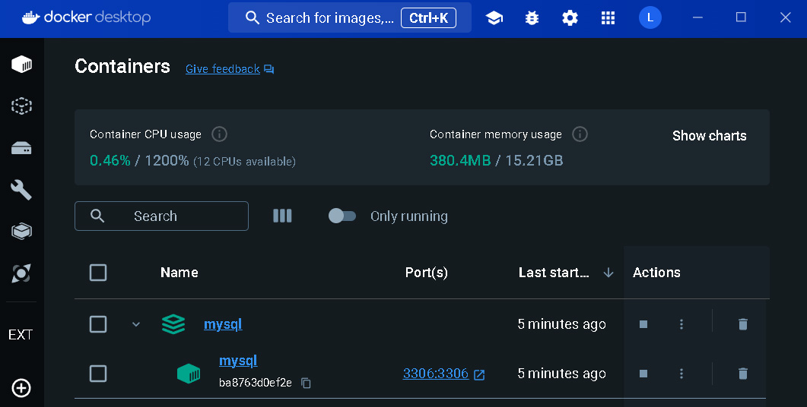

# Ejecutar MySQL con Docker Compose

Este repositorio proporciona un archivo de configuración de Docker Compose para ejecutar un contenedor de MySQL utilizando la versión 8.3.0.



## Requisitos previos

Antes de comenzar, asegúrate de tener Docker y Docker Compose instalados en tu sistema.

- [Docker](https://docs.docker.com/get-docker/)
- [Docker Compose](https://docs.docker.com/compose/install/)

## Uso

1. Clona este repositorio en tu máquina local:

   ```bash
   git clone https://github.com/Leonardo-villagran/mysql
   ```

2. Navega al directorio del repositorio clonado:

   ```bash
   cd tu_repositorio
   ```

3. Crea un archivo `.env` en el directorio raíz del repositorio y define las variables de entorno necesarias:

   ```bash
   MYSQL_ROOT_PASSWORD=tu_contraseña
   MYSQL_PORT=puerto_externo
   ```

4. Ejecuta el contenedor de MySQL utilizando Docker Compose:

   ```bash
   docker-compose up --build -d
   ```

5. Verifica que el contenedor esté en ejecución:

   ```bash
   docker ps
   ```

6. Puedes conectarte a la base de datos MySQL utilizando tu cliente favorito o ejecutando un contenedor de MySQL cliente:

   ```bash
   docker run -it --rm mysql mysql -h localhost -u root -p
   ```

## Variables de entorno

- `MYSQL_ROOT_PASSWORD`: Contraseña para el usuario root de MySQL.
- `MYSQL_PORT`: Puerto externo para acceder al servidor MySQL desde fuera del contenedor.

## Volumen de datos

Este proyecto utiliza un volumen de Docker para persistir los datos de MySQL en el directorio `./mysql-db-data` del repositorio. De esta manera, los datos se mantendrán incluso si el contenedor se elimina.

## Puertos

El puerto `3306` del contenedor MySQL se mapea al puerto definido en la variable `MYSQL_PORT` en el host.